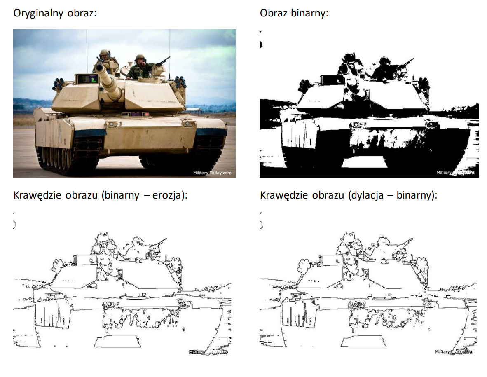

# Edge Detection Using Morphological Operations

## Overview
This project demonstrates edge detection in binary images using morphological operations such as **erosion** and **dilation**. By applying these operations with a Structuring Element (SE) Z4, we can extract the edges of objects in an image.

## Theoretical Background

### Morphological Operations
Morphological operations are used to process images based on shapes. The two key operations used here are:

1. **Erosion**:
   - The structuring element (SE) is applied to each pixel in the image.
   - If at least one pixel in the neighborhood covered by the SE has a value of zero, the central pixel is set to zero.
   - Otherwise, the central pixel retains its original value.

2. **Dilation**:
   - The structuring element (SE) is applied to each pixel in the image.
   - If at least one pixel in the neighborhood covered by the SE has a value of one, the central pixel is set to one.
   - Otherwise, the central pixel is set to zero.

### Edge Detection Methods
Edge detection is achieved using the following approaches:

1. **Binary Image - Eroded Image**:
   - Subtract the eroded image from the original binary image.
   - The resulting edges represent the **outline** of the object.

2. **Dilated Image - Binary Image**:
   - Subtract the original binary image from the dilated image.
   - The resulting edges represent the **envelope** of the object's outline.

### Structuring Element Z4
The SE Z4 considers one pixel in each direction (up, down, left, right) from the central pixel. This structuring element is used to perform erosion and dilation.

## Implementation

### Algorithm Steps
1. Traverse the image with the structuring element Z4.
2. For each pixel:
   - In **erosion**, if any pixel in the SE neighborhood is zero (255), set the central pixel to zero (255).
   - In **dilation**, if any pixel in the SE neighborhood is one (0), set the central pixel to one (0).
3. Perform edge detection:
   - Subtract the eroded image from the binary image. If the difference is 255, it indicates an edge.
   - Subtract the binary image from the dilated image. If the difference is 255, it indicates the object's outline.

# Example
